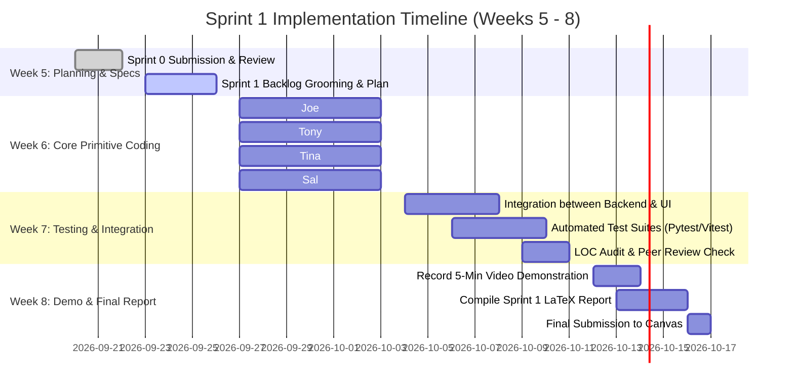

# UMKC Course Timetable Scheduler: Sprint 1 Master Plan & Execution Roadmap

**Course:** CS 5551 -- Advanced Software Engineering  
**Institution:** University of Missouri–Kansas City (UMKC)  
**Instructor:** Dr. Sudipta Chattopadhyay  
**Project:** UMKC Course Timetable Scheduler  
**Sprint Window:** Weeks 5–8 (Due Week 8)  
**Weight:** 25% Total Project Credit (19% Sprint 1 Report + 6% Video Demonstration)  

---

## 1. Executive Summary & Current Project Audit (Status Check)

### 1.1. Current State (Completed in Sprint 0)
* **Architecture & Repository:** Monorepo established with `/backend` (Python 3.12, FastAPI, SQLModel) and `/frontend` (React 18, Vite, TypeScript, Tailwind CSS). GitHub Actions CI pipeline configured.
* **Optimization Engine:** Google OR-Tools CP-SAT solver migrated into `backend/app/solver/` with **25/25 automated tests passing** across the real-volume UMKC dataset (40 courses, 20 faculty, 12 classrooms, 6 semesters).
* **Baseline Lines of Code (LOC):**
  * Backend Python: **2,572 LOC** (Engine, DataLoader, Data Generator, Entities, Smoke Tests).
  * Frontend TypeScript/React: **740 LOC** (App shell, layout, mock calendar, routing).
* **Existing Tests:**
  * Backend: 5 Pytest unit tests (`test_health.py`, `test_models.py`) + 25 solver verification tests (run via `python tests/solver/test_umkc_verification.py` and `python tests/solver/test_multi_semester_verification.py`; these are standalone scripts, not Pytest-collected).
  * Frontend: 3 Vitest tests passing (`App.test.tsx`, `Navbar.test.tsx`).

### 1.2. Gap Analysis for Sprint 1 (What Must Be Implemented)
To achieve full credit for Sprint 1, the prototype scaffolding must transition into a **fully working, integrated application** with primitive functions:

| Domain | Sprint 0 State | Required Sprint 1 Deliverable | Primary Owner |
| :--- | :--- | :--- | :--- |
| **Course & Room CRUD** | GET-only stubs, no validation, no write operations | Full REST CRUD (GET, POST, PUT, DELETE) with Pydantic validation and error handling | **Tony Nguyen** |
| **Database Seeding & Solver API** | Solver runs via CLI scripts; DB empty by default | SQLite Seeder (`core/seeder.py`) + Solver Run API (`/api/v1/solver/run`) persisting into DB | **Joe Doan** |
| **Instructor Preferences** | Static UI placeholder, basic POST stub without lookup | Dynamic reactive form UI + lookup endpoints + toast notifications + validation | **Tina Nguyen** |
| **Course/Room Admin UI** | Informational text cards only | Searchable data table, Add/Edit modals, delete confirmations | **Tina Nguyen** |
| **Interactive Timetable Matrix** | FullCalendar skeleton falling back to static mock JSON | Live API connection, Department/Instructor/Room multi-filter, event details modal | **Salvatore Nigro** |
| **Solver Execution UI & Export** | None | "Generate Timetable" on-demand trigger UI + CSV/JSON schedule download | **Salvatore Nigro** |
| **Automated Testing** | 8 basic tests | 35+ automated unit and integration tests across backend and frontend | **All Members** |

---

## 2. Team Work Allocation & 400+ LOC Compliance Strategy

CS 5551 requires **each individual student to author at least 400 lines of code (LOC)** spanning production and automated test code on GitHub. The table below outlines our balanced division of labor:

| Member & Role | Assigned Primitive Features | Production Code Files | Automated Test Files | Estimated LOC |
| :--- | :--- | :--- | :--- | :---: |
| **Joe Doan** *(Coordinator / Solver)* | • Database Seeder Service • Solver Execution Service • Solver API Bridge • Lead Demo Video & Minutes | `backend/app/services/solver_service.py` `backend/app/core/seeder.py` `backend/app/api/v1/routes_solver.py` | `backend/tests/test_solver_api.py` `backend/tests/test_seeder.py` | **480+ LOC** |
| **Tony Nguyen** *(Backend Lead)* | • Course REST CRUD API • Room REST CRUD API • Preference Lookup API • Pydantic Request/Response Schemas | `backend/app/api/v1/routes_courses.py` `backend/app/api/v1/routes_rooms.py` `backend/app/api/v1/routes_preferences.py` `backend/app/schemas/api_schemas.py` | `backend/tests/test_courses_api.py` `backend/tests/test_rooms_api.py` `backend/tests/test_preferences_api.py` | **680+ LOC** |
| **Tina Nguyen** *(Frontend Lead - Admin/Forms)* | • Interactive Preference Form • Course Management Portal • Room Management Portal • UI Validation & Toast Alerts | `frontend/src/pages/PreferencesPage.tsx` `frontend/src/components/admin/CourseManager.tsx` `frontend/src/components/admin/RoomManager.tsx` `frontend/src/components/common/Toast.tsx` | `frontend/src/pages/__tests__/PreferencesPage.test.tsx` `frontend/src/components/admin/__tests__/CourseManager.test.tsx` `frontend/src/components/admin/__tests__/RoomManager.test.tsx` | **700+ LOC** |
| **Salvatore Nigro** *(Frontend Lead - Calendar/Export)* | • Dynamic FullCalendar Matrix • Multi-Dimension Filters • Solver Run Trigger UI • CSV/JSON Schedule Export | `frontend/src/components/schedule/ScheduleCalendar.tsx` `frontend/src/components/schedule/ScheduleFilters.tsx` `frontend/src/components/schedule/SolverControlPanel.tsx` `frontend/src/utils/exportSchedule.ts` `frontend/src/services/scheduleService.ts` | `frontend/src/components/schedule/__tests__/ScheduleCalendar.test.tsx` `frontend/src/components/schedule/__tests__/ScheduleFilters.test.tsx` `frontend/src/utils/__tests__/exportSchedule.test.ts` | **690+ LOC** |

---

## 3. Specification of Requirements

### 3.1. User Stories Matrix (2 pts)

| Story ID | Persona (`<role>`) | Goal (`<goal>`) | Benefit (`<benefit>`) | Category | Priority | Story Points | Assignee |
| :---: | :--- | :--- | :--- | :---: | :---: | :---: | :---: |
| **US-1** | Course Coordinator | Seed initial UMKC catalog, faculty, and room datasets into the database | Bootstrap the application with real academic data instantly | Must-Have | High | 3 | Joe Doan |
| **US-2** | Course Coordinator | Trigger the CP-SAT solver on-demand via REST API for a target semester | Generate a conflict-free, 100% compliant timetable in seconds | Must-Have | Critical | 5 | Joe Doan |
| **US-3** | Course Coordinator | Create, read, update, and delete courses in the catalog via API | Maintain an accurate catalog with credit hours and lab requirements | Must-Have | High | 5 | Tony Nguyen |
| **US-4** | Course Coordinator | Manage classroom and laboratory spaces via API | Enforce room capacities and appropriate lab equipment assignments | Must-Have | High | 5 | Tony Nguyen |
| **US-5** | Faculty / Instructor | Submit teaching preferences (days, slots, rooms) via API | Communicate scheduling availability and preferences to the coordinator | Must-Have | High | 3 | Tony Nguyen |
| **US-6** | Faculty / Instructor | Use a reactive web form to select teaching day patterns and time slots | Submit preferences easily with immediate visual validation | Must-Have | High | 5 | Tina Nguyen |
| **US-7** | Course Coordinator | Manage courses and rooms through a web portal with search and modals | Administer academic resources visually without calling raw APIs | Must-Have | High | 5 | Tina Nguyen |
| **US-8** | Course Coordinator | View the weekly schedule matrix on FullCalendar with real-time filters | Inspect classroom assignments and detect department-level distribution | Must-Have | Critical | 5 | Salvatore Nigro |
| **US-9** | Course Coordinator | Trigger solver execution from the UI and export timetables to CSV/JSON | Share schedule drafts with faculty and administration outside the app | Must-Have | Medium | 3 | Salvatore Nigro |

---

### 3.2. Acceptance Criteria Matrix (10 pts) -- Given-When-Then

Each User Story is mapped to rigorous, testable Acceptance Criteria:

#### US-1: Database Seeding (Joe Doan)
* **AC 1.1 (Valid Seed):** 
  * *Given* an empty SQLite database,
  * *When* the coordinator runs `python -m app.core.seeder` or calls `POST /api/v1/admin/seed`,
  * *Then* exactly 20 users, 40 courses, 12 rooms, 6 semesters, and 6 time slots are inserted into the database with zero foreign key violations.
* **AC 1.2 (Idempotency):**
  * *Given* a database already containing seeded records,
  * *When* the seeder is executed a second time,
  * *Then* existing records are not duplicated and the record count remains unchanged.

#### US-2: Solver API Bridge & Execution (Joe Doan)
* **AC 2.1 (Valid Solve Execution):**
  * *Given* seeded catalog data and instructor preferences for semester ID 1,
  * *When* `POST /api/v1/solver/run` is requested with `{"semester_id": 1}`,
  * *Then* the server invokes Google OR-Tools CP-SAT, generates an OPTIMAL schedule with 40 confirmed course events, persists them to the `schedules` table, and returns HTTP 200 with solver runtime and status.
* **AC 2.2 (Invalid Semester ID):**
  * *Given* an invalid semester ID (e.g., `999`),
  * *When* `POST /api/v1/solver/run` is requested,
  * *Then* the server returns HTTP 404 Not Found with error message `"Semester 999 does not exist"`.
* **AC 2.3 (Infeasible Fallback):**
  * *Given* an artificially over-constrained preference dataset,
  * *When* the solver cannot find a solution satisfying all hard constraints,
  * *Then* the server returns HTTP 422 Unprocessable Entity with a diagnostic message detailing constraint bottlenecks.

#### US-3: Course Catalog CRUD (Tony Nguyen)
* **AC 3.1 (Create Course):**
  * *Given* valid course payload `{"course_code": "CS 451", "course_name": "Software Engineering II", "department": "CS", "credits": 3, "expected_enrollment": 35, "requires_lab": false}`,
  * *When* `POST /api/v1/courses` is executed,
  * *Then* the course is stored in DB and returns HTTP 201 Created with an assigned `id`.
* **AC 3.2 (Duplicate Course Code Rejection):**
  * *Given* an existing course with code `"CS 451"`,
  * *When* another `POST /api/v1/courses` is sent with `"CS 451"`,
  * *Then* the server rejects the request with HTTP 409 Conflict.
* **AC 3.3 (Filter Courses by Department):**
  * *Given* multiple courses across CS, ECE, and MATH,
  * *When* `GET /api/v1/courses?department=CS` is requested,
  * *Then* only courses belonging to the `"CS"` department are returned.
* **AC 3.4 (Update & Delete Course):**
  * *Given* an existing course ID `5`,
  * *When* `PUT /api/v1/courses/5` updates enrollment to `40`, HTTP 200 is returned with updated values; and when `DELETE /api/v1/courses/5` is called, HTTP 204 No Content is returned and subsequent `GET /api/v1/courses/5` returns HTTP 404.

#### US-4: Classroom & Lab Management CRUD (Tony Nguyen)
* **AC 4.1 (Create Room with Type):**
  * *Given* payload `{"building_id": 1, "room_number": "301", "capacity": 45, "room_type": "lab"}`,
  * *When* `POST /api/v1/rooms` is called,
  * *Then* the room is created with HTTP 201.
* **AC 4.2 (Capacity Boundary Validation):**
  * *Given* payload with negative capacity `{"capacity": -5}`,
  * *When* `POST /api/v1/rooms` is submitted,
  * *Then* the server rejects with HTTP 422 Unprocessable Entity.
* **AC 4.3 (Filter by Capacity and Type):**
  * *Given* rooms with capacities from 24 to 150,
  * *When* `GET /api/v1/rooms?min_capacity=50&room_type=lecture` is requested,
  * *Then* only lecture rooms with capacity $\ge 50$ are returned.

#### US-5: Instructor Preference Management API (Tony Nguyen)
* **AC 5.1 (Submit Teaching Preference):**
  * *Given* payload `{"user_id": 1, "semester_id": 1, "course_id": 3, "preferred_days": ["MWF"], "preferred_slots": ["09:00-09:50"], "preferred_rooms": ["RH 204"]}`,
  * *When* `POST /api/v1/preferences` is called,
  * *Then* HTTP 201 is returned and preference is saved.
* **AC 5.2 (Fetch Preferences by Instructor):**
  * *Given* instructor ID `1` has submitted preferences,
  * *When* `GET /api/v1/preferences?user_id=1&semester_id=1` is called,
  * *Then* the saved preferences for instructor `1` are returned as an array.

#### US-6: Interactive Preference Submission Portal UI (Tina Nguyen)
* **AC 6.1 (Interactive Selection):**
  * *Given* the user is on the `/preferences` page,
  * *When* the user selects an instructor and clicks day pills (e.g., `Monday (M)`, `Wednesday (W)`),
  * *Then* selected buttons change background color to active blue and update the internal form state.
* **AC 6.2 (Form Submission & Feedback):**
  * *Given* all required fields (Instructor, Course, Days, Time Slots) are chosen,
  * *When* the user clicks `"Submit Preferences"`,
  * *Then* the UI sends `POST /api/v1/preferences` and displays a green success toast alert: `"Preferences submitted successfully!"`.
* **AC 6.3 (Validation Alert on Empty Form):**
  * *Given* no days or slots are selected,
  * *When* the user clicks `"Submit Preferences"`,
  * *Then* form submission is blocked and a warning toast displays: `"Please select at least one teaching day and time slot."`.

#### US-7: Course & Room Admin Management Portal UI (Tina Nguyen)
* **AC 7.1 (Table Display & Filter):**
  * *Given* the user is on `/admin`,
  * *When* the user types `"CS"` in the course search bar,
  * *Then* the table filters in real-time to show only matching courses.
* **AC 7.2 (Add Course Modal):**
  * *Given* the admin clicks `"+ Add Course"`,
  * *When* the modal opens and valid data is submitted,
  * *Then* `POST /api/v1/courses` is executed, the modal closes, and the table updates with the newly created course.
* **AC 7.3 (Delete Course Confirmation):**
  * *Given* an existing course row in the table,
  * *When* the user clicks the Delete trash icon and confirms in the prompt,
  * *Then* `DELETE /api/v1/courses/{id}` is executed and the row disappears from the table.

#### US-8: FullCalendar Timetable Matrix & Multi-Filter (Salvatore Nigro)
* **AC 8.1 (Grid Rendering):**
  * *Given* the user visits `/schedule`,
  * *When* schedule events load from `GET /api/v1/schedules?semester_id=1`,
  * *Then* FullCalendar renders a Monday–Friday grid from 08:00 to 21:00 showing course codes, titles, instructor names, and room badges.
* **AC 8.2 (Dynamic Department Filtering):**
  * *Given* the schedule has courses from CS, ECE, and MATH,
  * *When* the user selects `"Computer Science"` in the department filter,
  * *Then* all non-CS course cards are immediately hidden from the calendar view without reloading the page.
* **AC 8.3 (Event Popover Details):**
  * *Given* a course card on the calendar,
  * *When* the user clicks the card,
  * *Then* a modal popover opens displaying course credits, expected enrollment, room capacity, and assigned instructor email.

#### US-9: Solver Trigger Dashboard & Schedule Export (Salvatore Nigro)
* **AC 9.1 (On-Demand Solver Trigger):**
  * *Given* the user is on the Schedule page,
  * *When* the user clicks `"Generate Optimal Schedule"`,
  * *Then* the button enters a loading state (`"Solving with CP-SAT..."`), calls `POST /api/v1/solver/run`, and on HTTP 200 refreshes the calendar events with the new schedule.
* **AC 9.2 (CSV & JSON Export):**
  * *Given* a displayed schedule,
  * *When* the user clicks `"Export as CSV"`,
  * *Then* a browser file download is triggered for `umkc_schedule_semester_1.csv` containing columns: `CourseCode, CourseName, Instructor, Room, DayPattern, StartTime, EndTime`.

---

## 4. Implementation Timeline & Deliverables Schedule

---

## 5. 5-Minute Demonstration Video Strategy (6 pts)

The video demo accounts for **6% of the final course grade**. The presentation must strictly adhere to the 5-minute cap and cover the following organized flow:

| Segment | Duration | Presenter | Content & Primitive Function Demonstrated |
| :---: | :---: | :--- | :--- |
| **1. Intro & Architecture** | 0:00 – 0:45 | **Joe Doan** | • Brief project intro: UMKC Course Timetable Scheduler. • Tech stack overview (FastAPI, React, OR-Tools). • Show repository structure and public GitHub repo. |
| **2. Course & Room CRUD** | 0:45 – 1:45 | **Tony Nguyen** | • Demonstrate Swagger UI (`/api/v1/docs`) executing `POST /api/v1/courses` and `GET /api/v1/courses`. • Demonstrate input validation: submit invalid capacity (-10) showing HTTP 422, duplicate course code showing HTTP 409. |
| **3. UI Management & Preferences** | 1:45 – 2:45 | **Tina Nguyen** | • Show live React UI on `/admin`: search course list, add a new course via modal. • Navigate to `/preferences`: select instructor, toggle day/time slots, submit preference and show green success toast. |
| **4. Calendar Matrix & Solver** | 2:45 – 4:00 | **Salvatore Nigro** | • Navigate to `/schedule`: inspect FullCalendar weekly view. • Filter by department (CS vs ECE) and instructor. • Click `"Generate Optimal Schedule"` button; show live solver run and timetable update. • Click `"Export CSV"` and open the downloaded file. |
| **5. Automated Testing & Wrap-up** | 4:00 – 5:00 | **All / Joe** | • Run terminal command `pytest backend/tests/` (show all tests passing). • Run terminal command `npm test` in `/frontend` (show Vitest passing). • Summary of Sprint 1 achievements and transition to Sprint 2. |

---

## 6. Meeting Schedule & Buddy Evaluation Tracking

* **Sprint 1 Planning Meeting:** Week 5, Tuesday, 2:30 PM CST.
* **Mid-Sprint Progress Check:** Week 6, Tuesday, 2:30 PM CST.
* **Code Review & Integration Stand-up:** Week 7, Tuesday, 2:30 PM CST.
* **Video Demo Recording & Report Finalization:** Week 8, Tuesday, 2:30 PM CST.
* **Buddy Rating Criteria (Scale 0.0 – 1.0):**
  * Punctuality in attending meetings and responding on Asana/Discord.
  * Code contribution compliance (minimum 400+ LOC verified via Git blame).
  * High-quality automated tests accompanying code.
  * Constructive code review feedback and collaboration.

---

## 7. Source Code Summary Table (To Be Completed Week 8)

The Sprint 1 report requires a comprehensive source code inventory listing every file, its type (production vs test), line count, developer, and contribution percentage. This table will be auto-generated using `git blame` and `wc -l` during Week 8 report compilation.

| Source File | Type | # LOC | Developer(s) | % Contribution |
| :--- | :--- | :---: | :--- | :---: |
| `backend/app/core/seeder.py` | Production | TBD | Joe Doan | 100% |
| `backend/app/services/solver_service.py` | Production | TBD | Joe Doan | 100% |
| `backend/app/api/v1/routes_solver.py` | Production | TBD | Joe Doan | 100% |
| `backend/app/api/v1/routes_courses.py` | Production | TBD | Tony Nguyen | 100% |
| `backend/app/api/v1/routes_rooms.py` | Production | TBD | Tony Nguyen | 100% |
| `backend/app/api/v1/routes_preferences.py` | Production | TBD | Tony Nguyen | 100% |
| `backend/app/schemas/api_schemas.py` | Production | TBD | Tony Nguyen | 100% |
| `frontend/src/pages/PreferencesPage.tsx` | Production | TBD | Tina Nguyen | 100% |
| `frontend/src/components/admin/CourseManager.tsx` | Production | TBD | Tina Nguyen | 100% |
| `frontend/src/components/admin/RoomManager.tsx` | Production | TBD | Tina Nguyen | 100% |
| `frontend/src/components/common/Toast.tsx` | Production | TBD | Tina Nguyen | 100% |
| `frontend/src/components/schedule/ScheduleCalendar.tsx` | Production | TBD | Salvatore Nigro | 100% |
| `frontend/src/components/schedule/ScheduleFilters.tsx` | Production | TBD | Salvatore Nigro | 100% |
| `frontend/src/components/schedule/SolverControlPanel.tsx` | Production | TBD | Salvatore Nigro | 100% |
| `frontend/src/utils/exportSchedule.ts` | Production | TBD | Salvatore Nigro | 100% |
| `backend/tests/test_seeder.py` | Test | TBD | Joe Doan | 100% |
| `backend/tests/test_solver_api.py` | Test | TBD | Joe Doan | 100% |
| `backend/tests/test_courses_api.py` | Test | TBD | Tony Nguyen | 100% |
| `backend/tests/test_rooms_api.py` | Test | TBD | Tony Nguyen | 100% |
| `backend/tests/test_preferences_api.py` | Test | TBD | Tony Nguyen | 100% |
| `frontend/src/pages/__tests__/PreferencesPage.test.tsx` | Test | TBD | Tina Nguyen | 100% |
| `frontend/src/components/admin/__tests__/CourseManager.test.tsx` | Test | TBD | Tina Nguyen | 100% |
| `frontend/src/components/schedule/__tests__/ScheduleCalendar.test.tsx` | Test | TBD | Salvatore Nigro | 100% |
| `frontend/src/utils/__tests__/exportSchedule.test.ts` | Test | TBD | Salvatore Nigro | 100% |

> **Note:** LOC values marked `TBD` will be filled in using `wc -l` and `git log --author` during Week 8 report finalization.
